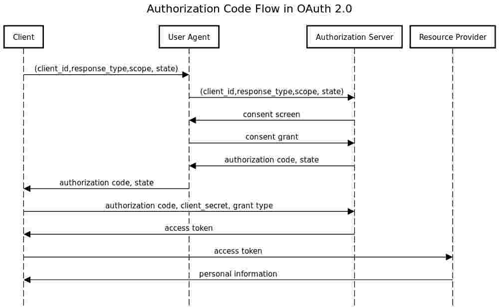

# OAuth 2.0 Authorization

The project aims to demonstrate the basic way of OAuth for granting authorization access to information in external system.

An additional goal is the implementation of the final project of "Technologie i systemy bezpieczeństwa komputerowego".

## Design assumptions

Integration will be carried out with Heroku as OAuth service provider.

The user interface will be minimized to JSON, because the full-fledged interface goes beyond the scope of the project.

The implementation will be done using NodeJS without using any library specialized in OAuth.

## Concept

OAuth 2.0 is the protocol defined in RFC6749. In the introduction to this document, it was defined using the following words:

> The OAuth 2.0 authorization framework enables a third-party application to obtain limited access to an HTTP service, either on behalf of a resource owner by orchestrating an approval interaction between the resource owner and the HTTP service, or by allowing the third-party application to obtain access on its own behalf.

Communication will be carried out as follows:

<!--
title Authorization Code Flow in OAuth 2.0

Client->User Agent: (client_id,response_type,scope, state)
User Agent->Authorization Server: (client_id,response_type,scope, state)
Authorization Server->User Agent: consent screen
User Agent->Authorization Server: consent grant
Authorization Server->User Agent: authorization code, state
User Agent->Client: authorization code, state
Client->Authorization Server: authorization code, client_secret, grant type
Authorization Server->Client: access token
Client->Resource Provider: access token
Resource Provider->Client: personal information
-->



## Implementation

Following endpoints was implemented:

* ```GET /``` - homepage which provide state about application and available endpoints (see ```index.js#L64-L73```)
* ```GET /oauth/authorize``` - redirect user to authorization server to URL which include encoded client_id,response_type,scope, state (see ```index.js#L75-L77```)
* ```GET /oauth/callback``` - receive authorization token, then ask authorization server to receive authorization server and store access token  in session (see ```index.js#L79-L91```)
* ```GET /me``` - fetch user profile from resource provider using access token available in session and put in response (see ```index.js#L94-L99```)
